# KnowledgeCity Platform - AWS Architecture Diagrams

## AWS Services Architecture Overview

```mermaid
graph TB
    %% Global Users
    Users[👥 Global Users<br/>knowledgecity.com
    
    %% AWS Global Services
    subgraph "AWS Global Services"
        CF[☁️ Amazon CloudFront<br/>Global CDN<br/>Edge Locations Worldwide]
        R53[🌐 Amazon Route 53<br/>DNS Service<br/>Health Checks<br/>Geographic Routing]
        S3_GLOBAL[📦 Amazon S3<br/>Global Content Storage<br/>Cross-Region Replication]
    end
    
    %% Primary Region (US-East-1)
    subgraph "AWS US-East-1 (Primary Region)"
        subgraph "VPC: 10.0.0.0/16"
            subgraph "Public Subnets"
                IGW1[🌍 Internet Gateway<br/>Public Internet Access]
                NAT1[🌐 NAT Gateway<br/>Private Subnet Internet Access]
                ALB1[⚖️ Application Load Balancer<br/>SSL Termination<br/>Health Checks]
            end
            
            subgraph "Private Subnets"
                EKS1[🚢 Amazon EKS Cluster<br/>Kubernetes Orchestration<br/>Node Groups: t3.medium/large, c5.2xlarge/4xlarge]
                subgraph "EKS Node Groups"
                    NG_GENERAL[💻 General Purpose Nodes<br/>t3.medium/large<br/>Min: 2, Max: 10]
                    NG_VIDEO[🎥 Video Processing Nodes<br/>c5.2xlarge/4xlarge<br/>Min: 1, Max: 5]
                end
            end
            
            subgraph "Database Subnets"
                RDS1[🗄️ Amazon RDS MySQL<br/>Multi-AZ Deployment<br/>db.r6g.xlarge<br/>100GB Storage]
            end
            
            subgraph "Application Services"
                PHP_APP[🐘 PHP Application<br/>Containerized on EKS<br/>Auto-scaling]
                CLICKHOUSE[📊 ClickHouse Analytics<br/>r6g.2xlarge x3<br/>Analytics Database]
                VIDEO_PROC[🎬 Video Processing<br/>FFmpeg Service<br/>GPU Enabled]
            end
        end
        
        subgraph "Security Services"
            WAF1[🛡️ AWS WAF<br/>DDoS Protection<br/>Rate Limiting<br/>Managed Rules]
            SG1[🔒 Security Groups<br/>Network Security Rules]
            KMS1[🔑 AWS KMS<br/>Encryption Keys<br/>AES-256]
        end
        
        subgraph "Storage Services"
            S3_PRIMARY[📦 Amazon S3<br/>Regional Storage<br/>Standard & IA Classes]
            EBS1[💾 Amazon EBS<br/>Persistent Storage<br/>EKS Volumes]
        end
    end
    
    %% Secondary Region (ME-South-1)
    subgraph "AWS ME-South-1 (Secondary Region)"
        subgraph "VPC: 10.1.0.0/16"
            subgraph "Public Subnets"
                IGW2[🌍 Internet Gateway<br/>Public Internet Access]
                NAT2[🌐 NAT Gateway<br/>Private Subnet Internet Access]
                ALB2[⚖️ Application Load Balancer<br/>SSL Termination<br/>Health Checks]
            end
            
            subgraph "Private Subnets"
                EKS2[🚢 Amazon EKS Cluster<br/>Kubernetes Orchestration<br/>Node Groups: t3.medium/large]
                subgraph "EKS Node Groups"
                    NG_GENERAL2[💻 General Purpose Nodes<br/>t3.medium/large<br/>Min: 2, Max: 8]
                end
            end
            
            subgraph "Database Subnets"
                RDS2[🗄️ Amazon RDS MySQL<br/>Multi-AZ Deployment<br/>db.r6g.xlarge<br/>100GB Storage]
            end
            
            subgraph "Application Services"
                PHP_APP2[🐘 PHP Application<br/>Containerized on EKS<br/>Auto-scaling]
            end
        end
        
        subgraph "Security Services"
            WAF2[🛡️ AWS WAF<br/>DDoS Protection<br/>Rate Limiting<br/>Managed Rules]
            SG2[🔒 Security Groups<br/>Network Security Rules]
            KMS2[🔑 AWS KMS<br/>Encryption Keys<br/>AES-256]
        end
        
        subgraph "Storage Services"
            S3_SECONDARY[📦 Amazon S3<br/>Regional Storage<br/>Standard & IA Classes]
            EBS2[💾 Amazon EBS<br/>Persistent Storage<br/>EKS Volumes]
        end
    end
    
    %% Monitoring & Observability
    subgraph "AWS Monitoring Stack"
        CW[📊 Amazon CloudWatch<br/>Metrics & Logs<br/>Dashboards]
        PROM[📈 Prometheus<br/>Application Metrics<br/>EKS Integration]
        GRAF[📊 Grafana<br/>Visualization<br/>CloudWatch Data Source]
        ALERT[🚨 Amazon SNS<br/>Alerting<br/>PagerDuty/Slack Integration]
    end
    
    %% Connections
    Users --> CF
    CF --> R53
    R53 --> ALB1
    R53 --> ALB2
    
    ALB1 --> WAF1
    ALB2 --> WAF2
    
    WAF1 --> EKS1
    WAF2 --> EKS2
    
    EKS1 --> PHP_APP
    EKS1 --> VIDEO_PROC
    EKS2 --> PHP_APP2
    
    PHP_APP --> RDS1
    PHP_APP2 --> RDS2
    VIDEO_PROC --> CLICKHOUSE
    
    PHP_APP --> S3_PRIMARY
    PHP_APP --> S3_GLOBAL
    PHP_APP2 --> S3_SECONDARY
    PHP_APP2 --> S3_GLOBAL
    
    EKS1 --> CW
    EKS2 --> CW
    RDS1 --> CW
    RDS2 --> CW
    
    CW --> PROM
    PROM --> GRAF
    CW --> ALERT
    
    %% Network connections
    EKS1 --> IGW1
    EKS2 --> IGW2
    RDS1 --> NAT1
    RDS2 --> NAT2
```

## AWS VPC Architecture with Subnets

```mermaid
graph TB
    %% Internet
    Internet[🌐 Internet]
    
    %% Primary Region VPC
    subgraph "AWS US-East-1 VPC<br/>CIDR: 10.0.0.0/16"
        subgraph "Availability Zone A (us-east-1a)"
            subgraph "Public Subnet A<br/>10.0.1.0/24<br/>Route Table: Public"
                IGW1[🌍 Internet Gateway<br/>Attached to VPC]
                NAT1[🌐 NAT Gateway<br/>Elastic IP: 10.0.1.10<br/>Route: 0.0.0.0/0 → IGW]
                ALB1[⚖️ Application Load Balancer<br/>10.0.1.20<br/>Target Group: EKS Nodes]
            end
            
            subgraph "Private Subnet A<br/>10.0.10.0/24<br/>Route Table: Private"
                EKS1_A[🚢 EKS Node 1<br/>10.0.10.10<br/>Instance Type: t3.medium]
                EKS2_A[🚢 EKS Node 2<br/>10.0.10.11<br/>Instance Type: t3.large]
                EKS3_A[🚢 EKS Video Node 1<br/>10.0.10.12<br/>Instance Type: c5.2xlarge]
            end
            
            subgraph "Database Subnet A<br/>10.0.20.0/24<br/>Route Table: Database"
                RDS1_A[🗄️ RDS Instance 1<br/>10.0.20.10<br/>Multi-AZ Primary]
            end
        end
        
        subgraph "Availability Zone B (us-east-1b)"
            subgraph "Public Subnet B<br/>10.0.2.0/24<br/>Route Table: Public"
                ALB2[⚖️ Application Load Balancer<br/>10.0.2.20<br/>Target Group: EKS Nodes]
            end
            
            subgraph "Private Subnet B<br/>10.0.11.0/24<br/>Route Table: Private"
                EKS4_B[🚢 EKS Node 3<br/>10.0.11.10<br/>Instance Type: t3.medium]
                EKS5_B[🚢 EKS Node 4<br/>10.0.11.11<br/>Instance Type: t3.large]
                EKS6_B[🚢 EKS Video Node 2<br/>10.0.11.12<br/>Instance Type: c5.4xlarge]
            end
            
            subgraph "Database Subnet B<br/>10.0.21.0/24<br/>Route Table: Database"
                RDS2_B[🗄️ RDS Instance 2<br/>10.0.21.10<br/>Multi-AZ Standby]
            end
        end
        
        subgraph "Availability Zone C (us-east-1c)"
            subgraph "Public Subnet C<br/>10.0.3.0/24<br/>Route Table: Public"
                ALB3[⚖️ Application Load Balancer<br/>10.0.3.20<br/>Target Group: EKS Nodes]
            end
            
            subgraph "Private Subnet C<br/>10.0.12.0/24<br/>Route Table: Private"
                EKS7_C[🚢 EKS Node 5<br/>10.0.12.10<br/>Instance Type: t3.medium]
                EKS8_C[🚢 EKS Node 6<br/>10.0.12.11<br/>Instance Type: t3.large]
            end
            
            subgraph "Database Subnet C<br/>10.0.22.0/24<br/>Route Table: Database"
                RDS3_C[🗄️ RDS Instance 3<br/>10.0.22.10<br/>Read Replica]
            end
        end
    end
    
    %% Secondary Region VPC
    subgraph "AWS ME-South-1 VPC<br/>CIDR: 10.1.0.0/16"
        subgraph "Availability Zone A (me-south-1a)"
            subgraph "Public Subnet A<br/>10.1.1.0/24<br/>Route Table: Public"
                IGW2[🌍 Internet Gateway<br/>Attached to VPC]
                NAT2[🌐 NAT Gateway<br/>Elastic IP: 10.1.1.10<br/>Route: 0.0.0.0/0 → IGW]
                ALB4[⚖️ Application Load Balancer<br/>10.1.1.20<br/>Target Group: EKS Nodes]
            end
            
            subgraph "Private Subnet A<br/>10.1.10.0/24<br/>Route Table: Private"
                EKS9_A[🚢 EKS Node 1<br/>10.1.10.10<br/>Instance Type: t3.medium]
                EKS10_A[🚢 EKS Node 2<br/>10.1.10.11<br/>Instance Type: t3.large]
            end
            
            subgraph "Database Subnet A<br/>10.1.20.0/24<br/>Route Table: Database"
                RDS4_A[🗄️ RDS Instance 1<br/>10.1.20.10<br/>Multi-AZ Primary]
            end
        end
        
        subgraph "Availability Zone B (me-south-1b)"
            subgraph "Public Subnet B<br/>10.1.2.0/24<br/>Route Table: Public"
                ALB5[⚖️ Application Load Balancer<br/>10.1.2.20<br/>Target Group: EKS Nodes]
            end
            
            subgraph "Private Subnet B<br/>10.1.11.0/24<br/>Route Table: Private"
                EKS11_B[🚢 EKS Node 3<br/>10.1.11.10<br/>Instance Type: t3.medium]
                EKS12_B[🚢 EKS Node 4<br/>10.1.11.11<br/>Instance Type: t3.large]
            end
            
            subgraph "Database Subnet B<br/>10.1.21.0/24<br/>Route Table: Database"
                RDS5_B[🗄️ RDS Instance 2<br/>10.1.21.10<br/>Multi-AZ Standby]
            end
        end
    end
    
    %% Global AWS Services
    subgraph "AWS Global Services"
        CF[☁️ Amazon CloudFront<br/>Distribution: knowledgecity.com<br/>Origin: S3 + ALB]
        R53[🌐 Amazon Route 53<br/>Hosted Zone: knowledgecity.com<br/>Health Checks: ALB Endpoints]
        S3[📦 Amazon S3<br/>Buckets: knowledgecity-content<br/>Cross-Region Replication]
    end
    
    %% Connections
    Internet --> IGW1
    Internet --> IGW2
    
    IGW1 --> ALB1
    IGW1 --> ALB2
    IGW1 --> ALB3
    IGW2 --> ALB4
    IGW2 --> ALB5
    
    NAT1 --> EKS1_A
    NAT1 --> EKS2_A
    NAT1 --> EKS3_A
    NAT1 --> EKS4_B
    NAT1 --> EKS5_B
    NAT1 --> EKS6_B
    NAT1 --> EKS7_C
    NAT1 --> EKS8_C
    
    NAT2 --> EKS9_A
    NAT2 --> EKS10_A
    NAT2 --> EKS11_B
    NAT2 --> EKS12_B
    
    ALB1 --> EKS1_A
    ALB1 --> EKS2_A
    ALB1 --> EKS3_A
    ALB2 --> EKS4_B
    ALB2 --> EKS5_B
    ALB2 --> EKS6_B
    ALB3 --> EKS7_C
    ALB3 --> EKS8_C
    
    ALB4 --> EKS9_A
    ALB4 --> EKS10_A
    ALB5 --> EKS11_B
    ALB5 --> EKS12_B
    
    EKS1_A --> RDS1_A
    EKS2_A --> RDS1_A
    EKS3_A --> RDS1_A
    EKS4_B --> RDS2_B
    EKS5_B --> RDS2_B
    EKS6_B --> RDS2_B
    EKS7_C --> RDS3_C
    EKS8_C --> RDS3_C
    
    EKS9_A --> RDS4_A
    EKS10_A --> RDS4_A
    EKS11_B --> RDS5_B
    EKS12_B --> RDS5_B
    
    CF --> R53
    R53 --> ALB1
    R53 --> ALB2
    R53 --> ALB3
    R53 --> ALB4
    R53 --> ALB5
    
    EKS1_A --> S3
    EKS2_A --> S3
    EKS3_A --> S3
    EKS4_B --> S3
    EKS5_B --> S3
    EKS6_B --> S3
    EKS7_C --> S3
    EKS8_C --> S3
    EKS9_A --> S3
    EKS10_A --> S3
    EKS11_B --> S3
    EKS12_B --> S3
```



## AWS Security Architecture


## AWS Cost Optimization Architecture

```mermaid
graph TB
    %% AWS Cost Management
    subgraph "AWS Cost Optimization"
        subgraph "Compute Optimization"
            RESERVED[💰 Reserved Instances<br/>1-3 Year Commitments<br/>Up to 72% Savings]
            SPOT[💰 Spot Instances<br/>Non-Critical Workloads<br/>Up to 90% Savings]
            AUTO_SCALE[📈 Auto Scaling<br/>Right-Size Resources<br/>Scale to Zero]
        end
        
        subgraph "Storage Optimization"
            S3_LIFECYCLE[📦 S3 Lifecycle Policies<br/>Standard → IA → Glacier<br/>Automatic Tiering]
            EBS_OPTIMIZATION[💾 EBS Optimization<br/>Right-Size Volumes<br/>Delete Unused]
            BACKUP_STRATEGY[💾 Backup Strategy<br/>Cross-Region Replication<br/>Retention Policies]
        end
        
        subgraph "Network Optimization"
            CLOUDFRONT[☁️ CloudFront CDN<br/>Reduce Data Transfer<br/>Edge Caching]
            VPC_ENDPOINTS[🌐 VPC Endpoints<br/>Private Communication<br/>Reduce NAT Costs]
            ROUTE_OPTIMIZATION[🛣️ Route Optimization<br/>Direct Connect<br/>Cost-Effective Routing]
        end
        
        subgraph "Monitoring & Billing"
            COST_EXPLORER[📊 AWS Cost Explorer<br/>Cost Analysis<br/>Usage Optimization]
            BUDGETS[💰 AWS Budgets<br/>Spending Alerts<br/>Cost Controls]
            TAGS[🏷️ Resource Tagging<br/>Cost Allocation<br/>Department Billing]
        end
    end
    
    %% Cost Allocation
    subgraph "Cost Allocation by Service"
        subgraph "Compute Costs (40%)"
            EKS_COST[🚢 EKS: $2,000/month<br/>Node Groups, Control Plane]
            EC2_COST[💻 EC2: $1,500/month<br/>Reserved Instances]
        end
        
        subgraph "Storage Costs (25%)"
            S3_COST[📦 S3: $800/month<br/>Standard, IA, Glacier]
            EBS_COST[💾 EBS: $400/month<br/>Persistent Volumes]
            RDS_COST[🗄️ RDS: $600/month<br/>Multi-AZ, Storage]
        end
        
        subgraph "Network Costs (20%)"
            CLOUDFRONT_COST[☁️ CloudFront: $300/month<br/>Data Transfer]
            ALB_COST[⚖️ ALB: $200/month<br/>Load Balancer Hours]
            NAT_COST[🌐 NAT Gateway: $200/month<br/>Data Processing]
        end
        
        subgraph "Security & Monitoring (15%)"
            WAF_COST[🛡️ WAF: $150/month<br/>Web ACL Rules]
            MONITORING_COST[📊 Monitoring: $300/month<br/>CloudWatch, Prometheus]
            KMS_COST[🔑 KMS: $50/month<br/>Key Management]
        end
    end
    
    %% Optimization Strategies
    subgraph "Optimization Strategies"
        subgraph "Immediate Savings"
            RIGHT_SIZE[📏 Right-Size Resources<br/>Monitor CPU/Memory Usage<br/>Downsize Underutilized]
            DELETE_UNUSED[🗑️ Delete Unused Resources<br/>Unattached EBS Volumes<br/>Unused Load Balancers]
        end
        
        subgraph "Long-term Savings"
            RESERVED_PURCHASE[💰 Purchase Reserved Instances<br/>Predictable Workloads<br/>1-3 Year Commitments]
            SPOT_IMPLEMENTATION[💰 Implement Spot Instances<br/>Non-Critical Workloads<br/>Fault-Tolerant Apps]
        end
        
        subgraph "Architecture Optimization"
            SERVERLESS[☁️ Serverless Options<br/>Lambda for Event Processing<br/>Fargate for Containers]
            CACHING[⚡ Implement Caching<br/>Redis for Session Data<br/>CloudFront for Static Content]
        end
    end
    
    %% Connections
    RESERVED --> EKS_COST
    SPOT --> EC2_COST
    AUTO_SCALE --> EKS_COST
    
    S3_LIFECYCLE --> S3_COST
    EBS_OPTIMIZATION --> EBS_COST
    BACKUP_STRATEGY --> S3_COST
    
    CLOUDFRONT --> CLOUDFRONT_COST
    VPC_ENDPOINTS --> NAT_COST
    ROUTE_OPTIMIZATION --> ALB_COST
    
    COST_EXPLORER --> RIGHT_SIZE
    BUDGETS --> DELETE_UNUSED
    TAGS --> RESERVED_PURCHASE
    
    RIGHT_SIZE --> EKS_COST
    DELETE_UNUSED --> EBS_COST
    RESERVED_PURCHASE --> EC2_COST
    SPOT_IMPLEMENTATION --> EKS_COST
    SERVERLESS --> EKS_COST
    CACHING --> CLOUDFRONT_COST
```



## AWS Service Integration Matrix

| AWS Service | Purpose | Configuration | Cost Estimate |
|-------------|---------|---------------|---------------|
| **Amazon EKS** | Container orchestration | 2 clusters, 3-10 nodes each | $2,000/month |
| **Amazon RDS** | Managed databases | MySQL 8.0, Multi-AZ | $600/month |
| **Amazon S3** | Object storage | Standard, IA, Glacier | $800/month |
| **Amazon CloudFront** | Global CDN | Edge locations worldwide | $300/month |
| **Amazon Route 53** | DNS service | Health checks, routing | $50/month |
| **Application Load Balancer** | Load balancing | SSL termination, health checks | $200/month |
| **AWS WAF** | Web application firewall | DDoS protection, rate limiting | $150/month |
| **Amazon CloudWatch** | Monitoring | Metrics, logs, dashboards | $200/month |
| **Amazon KMS** | Key management | Encryption keys | $50/month |
| **NAT Gateway** | Internet access | Private subnet connectivity | $200/month |
| **VPC** | Network isolation | Multi-AZ, subnets | $50/month |
| **Security Groups** | Network security | Stateful firewall rules | $0/month |
| **IAM** | Access management | Roles, policies, users | $0/month |

## AWS Well-Architected Framework Compliance

### ✅ Operational Excellence
- **Infrastructure as Code**: Terraform for all resources
- **Automated Deployment**: CI/CD pipeline with GitHub Actions
- **Monitoring & Alerting**: CloudWatch, Prometheus, Grafana
- **Documentation**: Comprehensive architecture documentation

### ✅ Security
- **Identity & Access**: IAM roles, security groups, NACLs
- **Data Protection**: Encryption at rest and in transit
- **Infrastructure Security**: VPC isolation, WAF, Shield
- **Compliance**: GDPR, regional data regulations

### ✅ Reliability
- **High Availability**: Multi-AZ deployment across regions
- **Fault Tolerance**: Auto-scaling, health checks, failover
- **Disaster Recovery**: Cross-region replication, backups
- **Monitoring**: Comprehensive observability stack

### ✅ Performance Efficiency
- **Global Distribution**: CloudFront CDN, Route53 routing
- **Auto-scaling**: Dynamic resource allocation
- **Caching**: Multiple layers of caching
- **Optimization**: Right-sized resources, cost optimization

### ✅ Cost Optimization
- **Resource Optimization**: Reserved instances, spot instances
- **Storage Optimization**: S3 lifecycle policies, EBS optimization
- **Network Optimization**: CloudFront, VPC endpoints
- **Monitoring**: Cost Explorer, budgets, tagging

### ✅ Sustainability
- **Energy Efficiency**: AWS renewable energy commitment
- **Resource Optimization**: Right-sizing, auto-scaling
- **Carbon Footprint**: CloudFront reduces data transfer
- **Green Computing**: Serverless options where possible 