# KnowledgeCity Platform - Component Diagram

## System Architecture Overview

```mermaid
graph TB
    %% Global Users
    Users[🌍 Global Users<br/>knowledgecity.com]
    
    %% CloudFront CDN
    CF[☁️ CloudFront CDN<br/>Global Content Delivery<br/>Edge Locations Worldwide]
    
    %% Route53 DNS
    R53[🌐 Route53<br/>DNS + Health Checks<br/>Geographic Routing]
    
    %% Primary Region (US-East-1)
    subgraph "Primary Region (US-East-1)"
        subgraph "Security Layer"
            WAF1[🛡️ WAF<br/>DDoS Protection<br/>Rate Limiting]
            SG1[🔒 Security Groups<br/>NACLs]
        end
        
        subgraph "Load Balancing"
            ALB1[⚖️ Application Load Balancer<br/>SSL Termination<br/>Health Checks]
        end
        
        subgraph "Compute Layer"
            EKS1[🚢 EKS Cluster<br/>Kubernetes Orchestration]
            subgraph "Node Groups"
                NG1_G[💻 General Nodes<br/>t3.medium/large<br/>Min: 2, Max: 10]
                NG1_V[🎥 Video Processing<br/>c5.2xlarge/4xlarge<br/>Min: 1, Max: 5]
            end
        end
        
        subgraph "Application Services"
            PHP[🐘 PHP Application<br/>Core Business Logic<br/>API Endpoints]
            CH[📊 ClickHouse<br/>Analytics Database<br/>r6g.2xlarge x3]
            VP[🎬 Video Processing<br/>FFmpeg Service<br/>GPU Enabled]
        end
        
        subgraph "Data Layer"
            RDS1[🗄️ RDS MySQL 8.0<br/>US Users Data<br/>db.r6g.xlarge<br/>100GB Storage]
        end
        
        subgraph "Storage Layer"
            S3_G[📦 S3 Global Content<br/>Standard Storage<br/>Cross-Region Replication]
            S3_V[🎥 S3 Video Storage<br/>Standard-IA<br/>Lifecycle Policies]
        end
    end
    
    %% Secondary Region (ME-South-1)
    subgraph "Secondary Region (ME-South-1)"
        subgraph "Security Layer 2"
            WAF2[🛡️ WAF<br/>DDoS Protection<br/>Rate Limiting]
            SG2[🔒 Security Groups<br/>NACLs]
        end
        
        subgraph "Load Balancing 2"
            ALB2[⚖️ Application Load Balancer<br/>SSL Termination<br/>Health Checks]
        end
        
        subgraph "Compute Layer 2"
            EKS2[🚢 EKS Cluster<br/>Kubernetes Orchestration]
            subgraph "Node Groups 2"
                NG2_G[💻 General Nodes<br/>t3.medium/large<br/>Min: 2, Max: 8]
            end
        end
        
        subgraph "Application Services 2"
            PHP2[🐘 PHP Application<br/>Core Business Logic<br/>API Endpoints]
        end
        
        subgraph "Data Layer 2"
            RDS2[🗄️ RDS MySQL 8.0<br/>Saudi Users Data<br/>db.r6g.xlarge<br/>100GB Storage]
        end
        
        subgraph "Storage Layer 2"
            S3_G2[📦 S3 Global Content<br/>Replica Storage]
        end
    end
    
    %% Monitoring & Observability
    subgraph "Monitoring Stack"
        CW[📊 CloudWatch<br/>Metrics & Logs]
        PROM[📈 Prometheus<br/>Application Metrics]
        GRAF[📊 Grafana<br/>Dashboards]
        ALERT[🚨 Alerting<br/>PagerDuty/Slack]
    end
    
    %% VPC Networks
    subgraph "Network Architecture"
        VPC1[🌐 VPC Primary<br/>10.0.0.0/16<br/>3 AZs]
        VPC2[🌐 VPC Secondary<br/>10.1.0.0/16<br/>2 AZs]
        
        subgraph "Primary Subnets"
            PUB1[🌍 Public Subnets<br/>Internet Gateway]
            PRIV1[🔒 Private Subnets<br/>NAT Gateway]
            DB1[🗄️ Database Subnets<br/>RDS Placement]
        end
        
        subgraph "Secondary Subnets"
            PUB2[🌍 Public Subnets<br/>Internet Gateway]
            PRIV2[🔒 Private Subnets<br/>NAT Gateway]
            DB2[🗄️ Database Subnets<br/>RDS Placement]
        end
    end
    
    %% Connections
    Users --> CF
    CF --> R53
    R53 --> ALB1
    R53 --> ALB2
    
    ALB1 --> WAF1
    ALB2 --> WAF2
    
    WAF1 --> EKS1
    WAF2 --> EKS2
    
    EKS1 --> PHP
    EKS1 --> VP
    EKS2 --> PHP2
    
    PHP --> RDS1
    PHP2 --> RDS2
    VP --> CH
    
    PHP --> S3_G
    PHP --> S3_V
    PHP2 --> S3_G2
    
    EKS1 --> CW
    EKS2 --> CW
    RDS1 --> CW
    RDS2 --> CW
    
    CW --> PROM
    PROM --> GRAF
    GRAF --> ALERT
    
    %% Network connections
    EKS1 --> VPC1
    EKS2 --> VPC2
    RDS1 --> VPC1
    RDS2 --> VPC2
    ALB1 --> VPC1
    ALB2 --> VPC2
```

## Data Flow Diagram

```mermaid
flowchart TD
    %% User Request Flow
    User[👤 User Request] --> CF[CloudFront CDN]
    CF --> R53[Route53 DNS]
    
    %% Geographic Routing
    R53 --> |US Users| US_Region[🇺🇸 US Region]
    R53 --> |Saudi Users| SA_Region[🇸🇦 Saudi Region]
    
    %% US Region Flow
    US_Region --> ALB_US[ALB US]
    ALB_US --> WAF_US[WAF US]
    WAF_US --> EKS_US[EKS US]
    EKS_US --> PHP_US[PHP App US]
    PHP_US --> RDS_US[RDS MySQL US]
    PHP_US --> S3_US[S3 Storage US]
    
    %% Saudi Region Flow
    SA_Region --> ALB_SA[ALB Saudi]
    ALB_SA --> WAF_SA[WAF Saudi]
    WAF_SA --> EKS_SA[EKS Saudi]
    EKS_SA --> PHP_SA[PHP App Saudi]
    PHP_SA --> RDS_SA[RDS MySQL Saudi]
    PHP_SA --> S3_SA[S3 Storage Saudi]
    
    %% Video Processing Flow
    Video_Upload[📹 Video Upload] --> S3_Video[S3 Video Storage]
    S3_Video --> VP_Service[Video Processing Service]
    VP_Service --> ClickHouse[ClickHouse Analytics]
    VP_Service --> S3_Processed[Processed Video Storage]
    
    %% Analytics Flow
    User_Activity[📊 User Activity] --> PHP_US
    User_Activity --> PHP_SA
    PHP_US --> ClickHouse
    PHP_SA --> ClickHouse
    ClickHouse --> Analytics_Dashboard[Analytics Dashboard]
    
    %% Monitoring Flow
    EKS_US --> Monitoring[Monitoring Stack]
    EKS_SA --> Monitoring
    RDS_US --> Monitoring
    RDS_SA --> Monitoring
    Monitoring --> Alerts[Alerting System]
```

## Infrastructure Components Detail

### 1. Global Distribution Layer
- **CloudFront CDN**: Global content delivery with edge locations
- **Route53**: DNS management with health checks and geographic routing
- **Domain**: knowledgecity.com

### 2. Security Layer
- **WAF (Web Application Firewall)**: DDoS protection, rate limiting
- **Security Groups**: Network-level security rules
- **NACLs**: Additional network access control
- **KMS**: Key management for encryption

### 3. Load Balancing Layer
- **Application Load Balancers**: SSL termination, health checks
- **Target Groups**: Service discovery and routing
- **Health Checks**: Automated failover detection

### 4. Compute Layer
- **EKS Clusters**: Kubernetes orchestration
- **Node Groups**:
  - General Purpose: t3.medium/large (2-10 nodes)
  - Video Processing: c5.2xlarge/4xlarge (1-5 nodes)
- **Auto-scaling**: Based on CPU/memory utilization

### 5. Application Services
- **PHP Application**: Core business logic and APIs
- **ClickHouse**: Analytics database (3 nodes, r6g.2xlarge)
- **Video Processing**: FFmpeg-based service with GPU support

### 6. Data Storage Layer
- **RDS MySQL**: Regional databases (db.r6g.xlarge, 100GB)
- **S3 Storage**: 
  - Global Content: Standard storage
  - Video Storage: Standard-IA with lifecycle policies
- **Cross-Region Replication**: Data synchronization

### 7. Monitoring & Observability
- **CloudWatch**: AWS service monitoring
- **Prometheus**: Application metrics collection
- **Grafana**: Visualization and dashboards
- **Alerting**: PagerDuty/Slack integration

### 8. Network Architecture
- **VPCs**: Isolated network environments
- **Subnets**: Public, private, and database subnets
- **NAT Gateways**: Internet access for private resources
- **Internet Gateways**: Public internet connectivity

## Regional Data Compliance

### US Region (us-east-1)
- Serves US users
- Data stored exclusively in US-East-1
- 3 availability zones for high availability

### Saudi Region (me-south-1)
- Serves Saudi Arabian users
- Data stored exclusively in ME-South-1
- 2 availability zones for redundancy

### Global Content
- Replicated across regions
- Served via CloudFront CDN
- Optimized for global performance

## Performance Characteristics

- **High Availability**: 99.99% SLA target
- **Recovery Time Objective (RTO)**: 15 minutes
- **Recovery Point Objective (RPO)**: 5 minutes
- **Auto-scaling**: Dynamic resource allocation
- **Global Latency**: <100ms for 95% of users

## Security Features

- **Encryption**: At rest (AES-256) and in transit (TLS 1.2+)
- **Network Security**: VPC isolation, security groups, NACLs
- **Application Security**: WAF, rate limiting, input validation
- **Access Control**: IAM, RBAC, MFA
- **Compliance**: GDPR, regional data regulations 