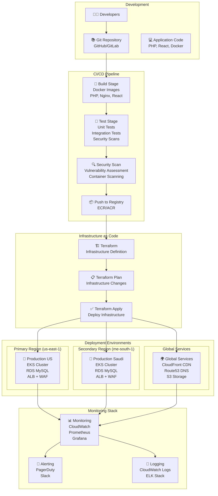
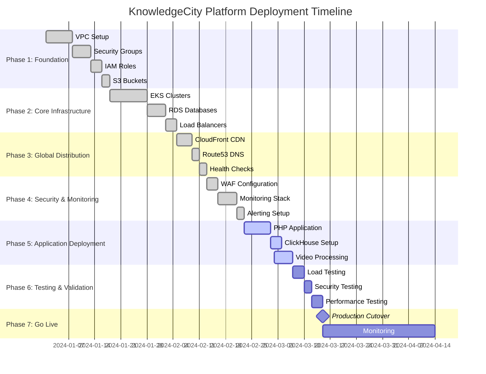
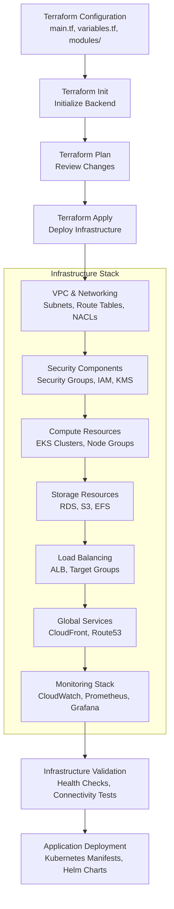
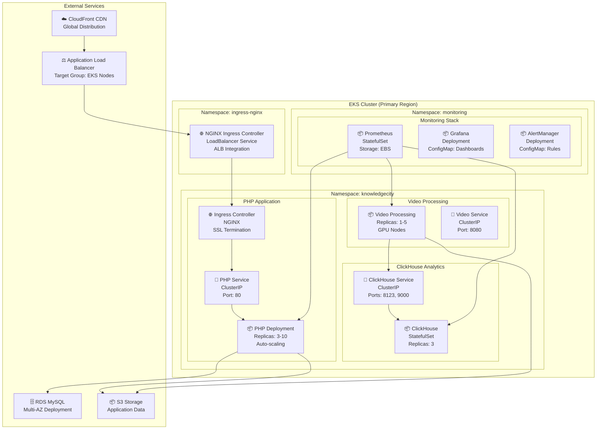
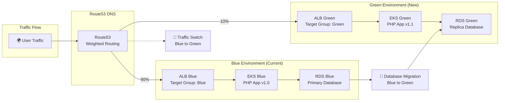
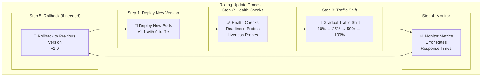

# KnowledgeCity Platform - Deployment Architecture

## CI/CD Pipeline Architecture



## Deployment Phases



## Infrastructure Deployment Flow



## Kubernetes Deployment Architecture



## Application Deployment Strategy

### Blue-Green Deployment



### Rolling Update Strategy



## Deployment Configuration Files

### Kubernetes Manifests Structure

```
k8s/
├── namespaces/
│   ├── knowledgecity.yaml
│   └── monitoring.yaml
├── deployments/
│   ├── php-app.yaml
│   ├── video-processor.yaml
│   └── clickhouse.yaml
├── services/
│   ├── php-service.yaml
│   ├── video-service.yaml
│   └── clickhouse-service.yaml
├── ingress/
│   ├── php-ingress.yaml
│   └── tls-secret.yaml
├── configmaps/
│   ├── php-config.yaml
│   └── monitoring-config.yaml
├── secrets/
│   ├── database-secret.yaml
│   └── api-keys-secret.yaml
└── monitoring/
    ├── prometheus.yaml
    ├── grafana.yaml
    └── alertmanager.yaml
```

### Helm Charts Structure

```
helm-charts/
├── knowledgecity/
│   ├── Chart.yaml
│   ├── values.yaml
│   ├── templates/
│   │   ├── deployment.yaml
│   │   ├── service.yaml
│   │   ├── ingress.yaml
│   │   └── configmap.yaml
│   └── charts/
│       ├── php-app/
│       ├── video-processor/
│       └── clickhouse/
└── monitoring/
    ├── Chart.yaml
    ├── values.yaml
    └── templates/
        ├── prometheus.yaml
        ├── grafana.yaml
        └── alertmanager.yaml
```

## Deployment Automation

### GitHub Actions Workflow

```yaml
name: Deploy to KnowledgeCity Platform

on:
  push:
    branches: [main, develop]
  pull_request:
    branches: [main]

jobs:
  test:
    runs-on: ubuntu-latest
    steps:
      - uses: actions/checkout@v3
      - name: Run Tests
        run: |
          docker-compose -f docker-compose.test.yml up --build --abort-on-container-exit

  build:
    needs: test
    runs-on: ubuntu-latest
    steps:
      - uses: actions/checkout@v3
      - name: Build Docker Images
        run: |
          docker build -t knowledgecity/php-app:${{ github.sha }} ./php-app
          docker build -t knowledgecity/video-processor:${{ github.sha }} ./video-processor

  deploy-infrastructure:
    needs: build
    runs-on: ubuntu-latest
    steps:
      - uses: actions/checkout@v3
      - name: Deploy Infrastructure
        run: |
          terraform init
          terraform plan
          terraform apply -auto-approve

  deploy-application:
    needs: deploy-infrastructure
    runs-on: ubuntu-latest
    steps:
      - uses: actions/checkout@v3
      - name: Deploy to EKS
        run: |
          kubectl apply -f k8s/
          kubectl rollout status deployment/php-app
```

## Monitoring and Alerting

### Key Metrics to Monitor

- **Infrastructure Metrics**: CPU, Memory, Disk, Network
- **Application Metrics**: Response Time, Error Rate, Throughput
- **Database Metrics**: Connections, Query Performance, Storage
- **Security Metrics**: Failed Logins, WAF Events, DDoS Attacks

### Alerting Rules

- **Critical**: Service Down, Database Unavailable, High Error Rate
- **Warning**: High Resource Usage, Slow Response Times, Disk Space Low
- **Info**: Deployment Success, Backup Completion, Security Scans

### Dashboard Configuration

- **Infrastructure Dashboard**: Resource utilization, network traffic
- **Application Dashboard**: User metrics, performance indicators
- **Security Dashboard**: Security events, compliance status
- **Business Dashboard**: User engagement, content consumption 