# KnowledgeCity Platform - Deployment Architecture

## CI/CD Pipeline Architecture

```mermaid
graph TB
    %% Development Environment
    subgraph "Development"
        DEV[👨‍💻 Developers]
        GIT[📚 Git Repository<br/>GitHub/GitLab]
        CODE[💻 Application Code<br/>PHP, React, Docker]
    end
    
    %% CI/CD Pipeline
    subgraph "CI/CD Pipeline"
        BUILD[🔨 Build Stage<br/>Docker Images<br/>PHP, Nginx, React]
        TEST[🧪 Test Stage<br/>Unit Tests<br/>Integration Tests<br/>Security Scans]
        SCAN[🔍 Security Scan<br/>Vulnerability Assessment<br/>Container Scanning]
        PUSH[📦 Push to Registry<br/>ECR/ACR]
    end
    
    %% Infrastructure as Code
    subgraph "Infrastructure as Code"
        TERRAFORM[🏗️ Terraform<br/>Infrastructure Definition]
        PLAN[📋 Terraform Plan<br/>Infrastructure Changes]
        APPLY[✅ Terraform Apply<br/>Deploy Infrastructure]
    end
    
    %% Deployment Environments
    subgraph "Deployment Environments"
        subgraph "Primary Region (us-east-1)"
            PROD_US[🚀 Production US<br/>EKS Cluster<br/>RDS MySQL<br/>ALB + WAF]
        end
        
        subgraph "Secondary Region (me-south-1)"
            PROD_SA[🚀 Production Saudi<br/>EKS Cluster<br/>RDS MySQL<br/>ALB + WAF]
        end
        
        subgraph "Global Services"
            GLOBAL[🌍 Global Services<br/>CloudFront CDN<br/>Route53 DNS<br/>S3 Storage]
        end
    end
    
    %% Monitoring & Observability
    subgraph "Monitoring Stack"
        MONITOR[📊 Monitoring<br/>CloudWatch<br/>Prometheus<br/>Grafana]
        ALERT[🚨 Alerting<br/>PagerDuty<br/>Slack]
        LOGS[📝 Logging<br/>CloudWatch Logs<br/>ELK Stack]
    end
    
    %% Connections
    DEV --> GIT
    GIT --> BUILD
    BUILD --> TEST
    TEST --> SCAN
    SCAN --> PUSH
    PUSH --> TERRAFORM
    
    TERRAFORM --> PLAN
    PLAN --> APPLY
    APPLY --> PROD_US
    APPLY --> PROD_SA
    APPLY --> GLOBAL
    
    PROD_US --> MONITOR
    PROD_SA --> MONITOR
    GLOBAL --> MONITOR
    
    MONITOR --> ALERT
    MONITOR --> LOGS
```



## Deployment Phases


## Infrastructure Deployment Flow


## Kubernetes Deployment Architecture

```mermaid
graph TB
    %% EKS Cluster
    subgraph "EKS Cluster (Primary Region)"
        subgraph "Namespace: knowledgecity"
            subgraph "PHP Application"
                PHP_DEPLOY[📦 PHP Deployment<br/>Replicas: 3-10<br/>Auto-scaling]
                PHP_SVC[🔗 PHP Service<br/>ClusterIP<br/>Port: 80]
                PHP_INGRESS[🌐 Ingress Controller<br/>NGINX<br/>SSL Termination]
            end
            
            subgraph "Video Processing"
                VP_DEPLOY[📦 Video Processing<br/>Replicas: 1-5<br/>GPU Nodes]
                VP_SVC[🔗 Video Service<br/>ClusterIP<br/>Port: 8080]
            end
            
            subgraph "ClickHouse Analytics"
                CH_DEPLOY[📦 ClickHouse<br/>StatefulSet<br/>Replicas: 3]
                CH_SVC[🔗 ClickHouse Service<br/>ClusterIP<br/>Ports: 8123, 9000]
            end
        end
        
        subgraph "Namespace: monitoring"
            subgraph "Monitoring Stack"
                PROM_DEPLOY[📦 Prometheus<br/>StatefulSet<br/>Storage: EBS]
                GRAF_DEPLOY[📦 Grafana<br/>Deployment<br/>ConfigMap: Dashboards]
                ALERT_DEPLOY[📦 AlertManager<br/>Deployment<br/>ConfigMap: Rules]
            end
        end
        
        subgraph "Namespace: ingress-nginx"
            NGINX_INGRESS[🌐 NGINX Ingress Controller<br/>LoadBalancer Service<br/>ALB Integration]
        end
    end
    
    %% External Services
    subgraph "External Services"
        ALB[⚖️ Application Load Balancer<br/>Target Group: EKS Nodes]
        RDS[🗄️ RDS MySQL<br/>Multi-AZ Deployment]
        S3[📦 S3 Storage<br/>Application Data]
        CLOUDFRONT[☁️ CloudFront CDN<br/>Global Distribution]
    end
    
    %% Connections
    ALB --> NGINX_INGRESS
    NGINX_INGRESS --> PHP_INGRESS
    PHP_INGRESS --> PHP_SVC
    PHP_SVC --> PHP_DEPLOY
    
    PHP_DEPLOY --> RDS
    PHP_DEPLOY --> S3
    
    VP_DEPLOY --> CH_SVC
    CH_SVC --> CH_DEPLOY
    
    VP_DEPLOY --> S3
    
    PROM_DEPLOY --> PHP_DEPLOY
    PROM_DEPLOY --> VP_DEPLOY
    PROM_DEPLOY --> CH_DEPLOY
    
    CLOUDFRONT --> ALB
```



## Application Deployment Strategy

### Blue-Green Deployment

```mermaid
graph LR
    subgraph "Blue Environment (Current)"
        BLUE_ALB[ALB Blue<br/>Target Group: Blue]
        BLUE_EKS[EKS Blue<br/>PHP App v1.0]
        BLUE_RDS[RDS Blue<br/>Primary Database]
    end
    
    subgraph "Green Environment (New)"
        GREEN_ALB[ALB Green<br/>Target Group: Green]
        GREEN_EKS[EKS Green<br/>PHP App v1.1]
        GREEN_RDS[RDS Green<br/>Replica Database]
    end
    
    subgraph "Route53 DNS"
        DNS[Route53<br/>Weighted Routing]
    end
    
    subgraph "Traffic Flow"
        TRAFFIC[🌍 User Traffic]
    end
    
    TRAFFIC --> DNS
    DNS --> |90%| BLUE_ALB
    DNS --> |10%| GREEN_ALB
    
    BLUE_ALB --> BLUE_EKS
    GREEN_ALB --> GREEN_EKS
    
    BLUE_EKS --> BLUE_RDS
    GREEN_EKS --> GREEN_RDS
    
    %% Migration Process
    MIGRATION[🔄 Database Migration<br/>Blue to Green]
    BLUE_RDS --> MIGRATION
    MIGRATION --> GREEN_RDS
    
    %% Switch Process
    SWITCH[🔄 Traffic Switch<br/>Blue to Green]
    DNS -.-> SWITCH
```



### Rolling Update Strategy

```mermaid
graph TB
    subgraph "Rolling Update Process"
        subgraph "Step 1: Deploy New Version"
            DEPLOY[🚀 Deploy New Pods<br/>v1.1 with 0 traffic]
        end
        
        subgraph "Step 2: Health Checks"
            HEALTH[✅ Health Checks<br/>Readiness Probes<br/>Liveness Probes]
        end
        
        subgraph "Step 3: Traffic Shift"
            TRAFFIC_SHIFT[🔄 Gradual Traffic Shift<br/>10% → 25% → 50% → 100%]
        end
        
        subgraph "Step 4: Monitor"
            MONITOR[📊 Monitor Metrics<br/>Error Rates<br/>Response Times]
        end
        
        subgraph "Step 5: Rollback (if needed)"
            ROLLBACK[🔄 Rollback to Previous Version<br/>v1.0]
        end
    end
    
    DEPLOY --> HEALTH
    HEALTH --> TRAFFIC_SHIFT
    TRAFFIC_SHIFT --> MONITOR
    MONITOR --> ROLLBACK
    ROLLBACK -.-> DEPLOY
```



## Deployment Configuration Files

### Kubernetes Manifests Structure

```
k8s/
├── namespaces/
│   ├── knowledgecity.yaml
│   └── monitoring.yaml
├── deployments/
│   ├── php-app.yaml
│   ├── video-processor.yaml
│   └── clickhouse.yaml
├── services/
│   ├── php-service.yaml
│   ├── video-service.yaml
│   └── clickhouse-service.yaml
├── ingress/
│   ├── php-ingress.yaml
│   └── tls-secret.yaml
├── configmaps/
│   ├── php-config.yaml
│   └── monitoring-config.yaml
├── secrets/
│   ├── database-secret.yaml
│   └── api-keys-secret.yaml
└── monitoring/
    ├── prometheus.yaml
    ├── grafana.yaml
    └── alertmanager.yaml
```

### Helm Charts Structure

```
helm-charts/
├── knowledgecity/
│   ├── Chart.yaml
│   ├── values.yaml
│   ├── templates/
│   │   ├── deployment.yaml
│   │   ├── service.yaml
│   │   ├── ingress.yaml
│   │   └── configmap.yaml
│   └── charts/
│       ├── php-app/
│       ├── video-processor/
│       └── clickhouse/
└── monitoring/
    ├── Chart.yaml
    ├── values.yaml
    └── templates/
        ├── prometheus.yaml
        ├── grafana.yaml
        └── alertmanager.yaml
```

## Deployment Automation

### GitHub Actions Workflow

```yaml
name: Deploy to KnowledgeCity Platform

on:
  push:
    branches: [main, develop]
  pull_request:
    branches: [main]

jobs:
  test:
    runs-on: ubuntu-latest
    steps:
      - uses: actions/checkout@v3
      - name: Run Tests
        run: |
          docker-compose -f docker-compose.test.yml up --build --abort-on-container-exit

  build:
    needs: test
    runs-on: ubuntu-latest
    steps:
      - uses: actions/checkout@v3
      - name: Build Docker Images
        run: |
          docker build -t knowledgecity/php-app:${{ github.sha }} ./php-app
          docker build -t knowledgecity/video-processor:${{ github.sha }} ./video-processor

  deploy-infrastructure:
    needs: build
    runs-on: ubuntu-latest
    steps:
      - uses: actions/checkout@v3
      - name: Deploy Infrastructure
        run: |
          terraform init
          terraform plan
          terraform apply -auto-approve

  deploy-application:
    needs: deploy-infrastructure
    runs-on: ubuntu-latest
    steps:
      - uses: actions/checkout@v3
      - name: Deploy to EKS
        run: |
          kubectl apply -f k8s/
          kubectl rollout status deployment/php-app
```

## Monitoring and Alerting

### Key Metrics to Monitor

- **Infrastructure Metrics**: CPU, Memory, Disk, Network
- **Application Metrics**: Response Time, Error Rate, Throughput
- **Database Metrics**: Connections, Query Performance, Storage
- **Security Metrics**: Failed Logins, WAF Events, DDoS Attacks

### Alerting Rules

- **Critical**: Service Down, Database Unavailable, High Error Rate
- **Warning**: High Resource Usage, Slow Response Times, Disk Space Low
- **Info**: Deployment Success, Backup Completion, Security Scans

### Dashboard Configuration

- **Infrastructure Dashboard**: Resource utilization, network traffic
- **Application Dashboard**: User metrics, performance indicators
- **Security Dashboard**: Security events, compliance status
- **Business Dashboard**: User engagement, content consumption 