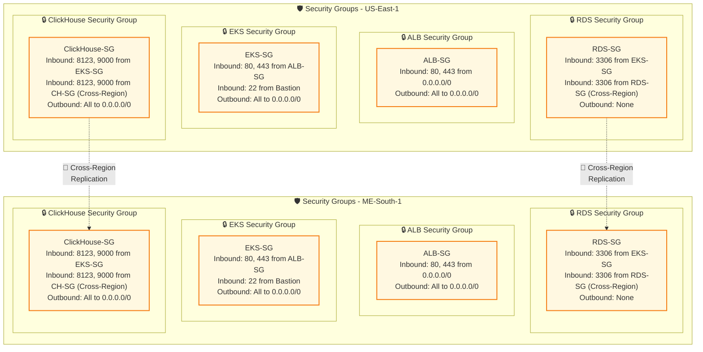
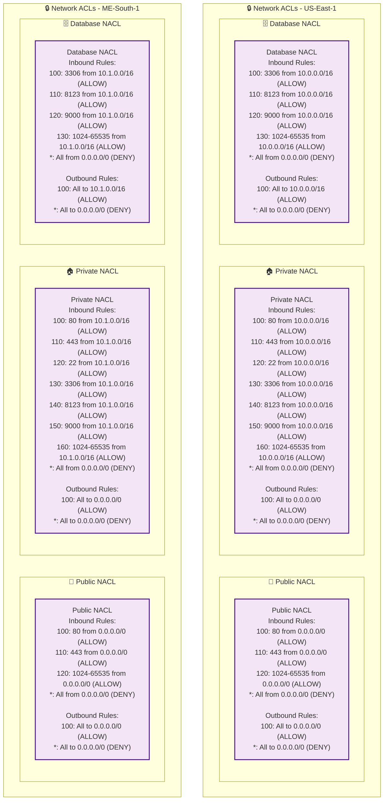
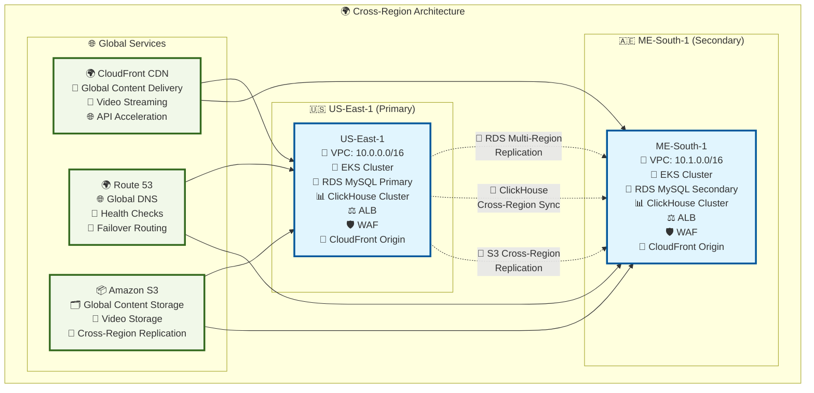

# 🌐 **KnowledgeCity Network Architecture - Detailed**

## **AWS Multi-Region Network Topology**

```mermaid
graph TB
    %% AWS Regions
    subgraph "🌍 AWS Global Infrastructure"
        subgraph "🇺🇸 US-East-1 (Primary Region)"
            subgraph "🏢 VPC: 10.0.0.0/16"
                subgraph "🌐 Public Subnets"
                    subgraph "📡 Public Subnet 1"
                        PS1["10.0.1.0/24<br/>AZ: us-east-1a<br/>📡 Internet Gateway<br/>🌐 NAT Gateway<br/>🔒 Route Table: 0.0.0.0/0 → IGW"]
                    end
                    subgraph "📡 Public Subnet 2"
                        PS2["10.0.2.0/24<br/>AZ: us-east-1b<br/>🌐 NAT Gateway<br/>🔒 Route Table: 0.0.0.0/0 → IGW"]
                    end
                    subgraph "📡 Public Subnet 3"
                        PS3["10.0.3.0/24<br/>AZ: us-east-1c<br/>🌐 NAT Gateway<br/>🔒 Route Table: 0.0.0.0/0 → IGW"]
                    end
                end
                
                subgraph "🏠 Private Subnets"
                    subgraph "🏠 Private Subnet 1"
                        PRS1["10.0.11.0/24<br/>AZ: us-east-1a<br/>🔒 Route Table: 0.0.0.0/0 → NAT<br/>🐳 EKS Node Group 1<br/>⚖️ ALB Backend"]
                    end
                    subgraph "🏠 Private Subnet 2"
                        PRS2["10.0.12.0/24<br/>AZ: us-east-1b<br/>🔒 Route Table: 0.0.0.0/0 → NAT<br/>🐳 EKS Node Group 2<br/>⚖️ ALB Backend"]
                    end
                    subgraph "🏠 Private Subnet 3"
                        PRS3["10.0.13.0/24<br/>AZ: us-east-1c<br/>🔒 Route Table: 0.0.0.0/0 → NAT<br/>🐳 EKS Node Group 3<br/>⚖️ ALB Backend"]
                    end
                end
                
                subgraph "🗄️ Database Subnets"
                    subgraph "🗄️ DB Subnet 1"
                        DBS1["10.0.21.0/24<br/>AZ: us-east-1a<br/>🔒 Route Table: 0.0.0.0/0 → NAT<br/>🐘 RDS MySQL Primary<br/>📊 ClickHouse Node 1"]
                    end
                    subgraph "🗄️ DB Subnet 2"
                        DBS2["10.0.22.0/24<br/>AZ: us-east-1b<br/>🔒 Route Table: 0.0.0.0/0 → NAT<br/>🐘 RDS MySQL Read Replica<br/>📊 ClickHouse Node 2"]
                    end
                    subgraph "🗄️ DB Subnet 3"
                        DBS3["10.0.23.0/24<br/>AZ: us-east-1c<br/>🔒 Route Table: 0.0.0.0/0 → NAT<br/>📊 ClickHouse Node 3"]
                    end
                end
            end
        end
        
        subgraph "🇦🇪 ME-South-1 (Secondary Region)"
            subgraph "🏢 VPC: 10.1.0.0/16"
                subgraph "🌐 Public Subnets"
                    subgraph "📡 Public Subnet 1"
                        PS1_2["10.1.1.0/24<br/>AZ: me-south-1a<br/>📡 Internet Gateway<br/>🌐 NAT Gateway<br/>🔒 Route Table: 0.0.0.0/0 → IGW"]
                    end
                    subgraph "📡 Public Subnet 2"
                        PS2_2["10.1.2.0/24<br/>AZ: me-south-1b<br/>🌐 NAT Gateway<br/>🔒 Route Table: 0.0.0.0/0 → IGW"]
                    end
                    subgraph "📡 Public Subnet 3"
                        PS3_2["10.1.3.0/24<br/>AZ: me-south-1c<br/>🌐 NAT Gateway<br/>🔒 Route Table: 0.0.0.0/0 → IGW"]
                    end
                end
                
                subgraph "🏠 Private Subnets"
                    subgraph "🏠 Private Subnet 1"
                        PRS1_2["10.1.11.0/24<br/>AZ: me-south-1a<br/>🔒 Route Table: 0.0.0.0/0 → NAT<br/>🐳 EKS Node Group 1<br/>⚖️ ALB Backend"]
                    end
                    subgraph "🏠 Private Subnet 2"
                        PRS2_2["10.1.12.0/24<br/>AZ: me-south-1b<br/>🔒 Route Table: 0.0.0.0/0 → NAT<br/>🐳 EKS Node Group 2<br/>⚖️ ALB Backend"]
                    end
                    subgraph "🏠 Private Subnet 3"
                        PRS3_2["10.1.13.0/24<br/>AZ: me-south-1c<br/>🔒 Route Table: 0.0.0.0/0 → NAT<br/>🐳 EKS Node Group 3<br/>⚖️ ALB Backend"]
                    end
                end
                
                subgraph "🗄️ Database Subnets"
                    subgraph "🗄️ DB Subnet 1"
                        DBS1_2["10.1.21.0/24<br/>AZ: me-south-1a<br/>🔒 Route Table: 0.0.0.0/0 → NAT<br/>🐘 RDS MySQL Secondary<br/>📊 ClickHouse Node 1"]
                    end
                    subgraph "🗄️ DB Subnet 2"
                        DBS2_2["10.1.22.0/24<br/>AZ: me-south-1b<br/>🔒 Route Table: 0.0.0.0/0 → NAT<br/>📊 ClickHouse Node 2"]
                    end
                    subgraph "🗄️ DB Subnet 3"
                        DBS3_2["10.1.23.0/24<br/>AZ: me-south-1c<br/>🔒 Route Table: 0.0.0.0/0 → NAT<br/>📊 ClickHouse Node 3"]
                    end
                end
            end
        end
    end
    
    %% Cross-Region Connections
    PS1 -.->|"🔄 Cross-Region<br/>Replication"| PS1_2
    DBS1 -.->|"🔄 RDS<br/>Multi-Region"| DBS1_2
    
    %% Internet Connection
    subgraph "🌍 Internet"
        INTERNET["🌐 Global Internet<br/>📡 CloudFront CDN<br/>🌍 Route 53 DNS"]
    end
    
    %% Connect to Internet
    PS1 --> INTERNET
    PS1_2 --> INTERNET
    
    %% Styling
    classDef regionStyle fill:#e1f5fe,stroke:#01579b,stroke-width:2px
    classDef vpcStyle fill:#f3e5f5,stroke:#4a148c,stroke-width:2px
    classDef publicStyle fill:#e8f5e8,stroke:#2e7d32,stroke-width:2px
    classDef privateStyle fill:#fff3e0,stroke:#ef6c00,stroke-width:2px
    classDef dbStyle fill:#fce4ec,stroke:#c2185b,stroke-width:2px
    classDef internetStyle fill:#f1f8e9,stroke:#33691e,stroke-width:2px
    
    class "🇺🇸 US-East-1 (Primary Region)","🇦🇪 ME-South-1 (Secondary Region)" regionStyle
    class "🏢 VPC: 10.0.0.0/16","🏢 VPC: 10.1.0.0/16" vpcStyle
    class "🌐 Public Subnets" publicStyle
    class "🏠 Private Subnets" privateStyle
    class "🗄️ Database Subnets" dbStyle
    class "🌍 Internet" internetStyle
```

## **🔒 Security Groups Configuration**

```mermaid
graph TB
    subgraph "🛡️ Security Groups - US-East-1"
        subgraph "🔒 ALB Security Group"
            ALB_SG["ALB-SG<br/>Inbound: 80, 443 from 0.0.0.0/0<br/>Outbound: All to 0.0.0.0/0"]
        end
        
        subgraph "🔒 EKS Security Group"
            EKS_SG["EKS-SG<br/>Inbound: 80, 443 from ALB-SG<br/>Inbound: 22 from Bastion<br/>Outbound: All to 0.0.0.0/0"]
        end
        
        subgraph "🔒 RDS Security Group"
            RDS_SG["RDS-SG<br/>Inbound: 3306 from EKS-SG<br/>Inbound: 3306 from RDS-SG (Cross-Region)<br/>Outbound: None"]
        end
        
        subgraph "🔒 ClickHouse Security Group"
            CH_SG["ClickHouse-SG<br/>Inbound: 8123, 9000 from EKS-SG<br/>Inbound: 8123, 9000 from CH-SG (Cross-Region)<br/>Outbound: All to 0.0.0.0/0"]
        end
    end
    
    subgraph "🛡️ Security Groups - ME-South-1"
        subgraph "🔒 ALB Security Group"
            ALB_SG_2["ALB-SG<br/>Inbound: 80, 443 from 0.0.0.0/0<br/>Outbound: All to 0.0.0.0/0"]
        end
        
        subgraph "🔒 EKS Security Group"
            EKS_SG_2["EKS-SG<br/>Inbound: 80, 443 from ALB-SG<br/>Inbound: 22 from Bastion<br/>Outbound: All to 0.0.0.0/0"]
        end
        
        subgraph "🔒 RDS Security Group"
            RDS_SG_2["RDS-SG<br/>Inbound: 3306 from EKS-SG<br/>Inbound: 3306 from RDS-SG (Cross-Region)<br/>Outbound: None"]
        end
        
        subgraph "🔒 ClickHouse Security Group"
            CH_SG_2["ClickHouse-SG<br/>Inbound: 8123, 9000 from EKS-SG<br/>Inbound: 8123, 9000 from CH-SG (Cross-Region)<br/>Outbound: All to 0.0.0.0/0"]
        end
    end
    
    %% Cross-Region Security Group Connections
    RDS_SG -.->|"🔄 Cross-Region<br/>Replication"| RDS_SG_2
    CH_SG -.->|"🔄 Cross-Region<br/>Replication"| CH_SG_2
    
    %% Styling
    classDef sgStyle fill:#fff8e1,stroke:#f57f17,stroke-width:2px
    class ALB_SG,EKS_SG,RDS_SG,CH_SG,ALB_SG_2,EKS_SG_2,RDS_SG_2,CH_SG_2 sgStyle
```

## **🌐 Network ACLs Configuration**

```mermaid
graph TB
    subgraph "🔒 Network ACLs - US-East-1"
        subgraph "📡 Public NACL"
            PUBLIC_NACL["Public NACL<br/>Inbound Rules:<br/>100: 80 from 0.0.0.0/0 (ALLOW)<br/>110: 443 from 0.0.0.0/0 (ALLOW)<br/>120: 1024-65535 from 0.0.0.0/0 (ALLOW)<br/>*: All from 0.0.0.0/0 (DENY)<br/><br/>Outbound Rules:<br/>100: All to 0.0.0.0/0 (ALLOW)<br/>*: All to 0.0.0.0/0 (DENY)"]
        end
        
        subgraph "🏠 Private NACL"
            PRIVATE_NACL["Private NACL<br/>Inbound Rules:<br/>100: 80 from 10.0.0.0/16 (ALLOW)<br/>110: 443 from 10.0.0.0/16 (ALLOW)<br/>120: 22 from 10.0.0.0/16 (ALLOW)<br/>130: 3306 from 10.0.0.0/16 (ALLOW)<br/>140: 8123 from 10.0.0.0/16 (ALLOW)<br/>150: 9000 from 10.0.0.0/16 (ALLOW)<br/>160: 1024-65535 from 10.0.0.0/16 (ALLOW)<br/>*: All from 0.0.0.0/0 (DENY)<br/><br/>Outbound Rules:<br/>100: All to 0.0.0.0/0 (ALLOW)<br/>*: All to 0.0.0.0/0 (DENY)"]
        end
        
        subgraph "🗄️ Database NACL"
            DB_NACL["Database NACL<br/>Inbound Rules:<br/>100: 3306 from 10.0.0.0/16 (ALLOW)<br/>110: 8123 from 10.0.0.0/16 (ALLOW)<br/>120: 9000 from 10.0.0.0/16 (ALLOW)<br/>130: 1024-65535 from 10.0.0.0/16 (ALLOW)<br/>*: All from 0.0.0.0/0 (DENY)<br/><br/>Outbound Rules:<br/>100: All to 10.0.0.0/16 (ALLOW)<br/>*: All to 0.0.0.0/0 (DENY)"]
        end
    end
    
    subgraph "🔒 Network ACLs - ME-South-1"
        subgraph "📡 Public NACL"
            PUBLIC_NACL_2["Public NACL<br/>Inbound Rules:<br/>100: 80 from 0.0.0.0/0 (ALLOW)<br/>110: 443 from 0.0.0.0/0 (ALLOW)<br/>120: 1024-65535 from 0.0.0.0/0 (ALLOW)<br/>*: All from 0.0.0.0/0 (DENY)<br/><br/>Outbound Rules:<br/>100: All to 0.0.0.0/0 (ALLOW)<br/>*: All to 0.0.0.0/0 (DENY)"]
        end
        
        subgraph "🏠 Private NACL"
            PRIVATE_NACL_2["Private NACL<br/>Inbound Rules:<br/>100: 80 from 10.1.0.0/16 (ALLOW)<br/>110: 443 from 10.1.0.0/16 (ALLOW)<br/>120: 22 from 10.1.0.0/16 (ALLOW)<br/>130: 3306 from 10.1.0.0/16 (ALLOW)<br/>140: 8123 from 10.1.0.0/16 (ALLOW)<br/>150: 9000 from 10.1.0.0/16 (ALLOW)<br/>160: 1024-65535 from 10.1.0.0/16 (ALLOW)<br/>*: All from 0.0.0.0/0 (DENY)<br/><br/>Outbound Rules:<br/>100: All to 0.0.0.0/0 (ALLOW)<br/>*: All to 0.0.0.0/0 (DENY)"]
        end
        
        subgraph "🗄️ Database NACL"
            DB_NACL_2["Database NACL<br/>Inbound Rules:<br/>100: 3306 from 10.1.0.0/16 (ALLOW)<br/>110: 8123 from 10.1.0.0/16 (ALLOW)<br/>120: 9000 from 10.1.0.0/16 (ALLOW)<br/>130: 1024-65535 from 10.1.0.0/16 (ALLOW)<br/>*: All from 0.0.0.0/0 (DENY)<br/><br/>Outbound Rules:<br/>100: All to 10.1.0.0/16 (ALLOW)<br/>*: All to 0.0.0.0/0 (DENY)"]
        end
    end
    
    %% Styling
    classDef naclStyle fill:#f3e5f5,stroke:#4a148c,stroke-width:2px
    class PUBLIC_NACL,PRIVATE_NACL,DB_NACL,PUBLIC_NACL_2,PRIVATE_NACL_2,DB_NACL_2 naclStyle
```

## **🔄 Cross-Region Connectivity**

```mermaid
graph TB
    subgraph "🌍 Cross-Region Architecture"
        subgraph "🇺🇸 US-East-1 (Primary)"
            US_EAST["US-East-1<br/>🏢 VPC: 10.0.0.0/16<br/>🐳 EKS Cluster<br/>🐘 RDS MySQL Primary<br/>📊 ClickHouse Cluster<br/>⚖️ ALB<br/>🛡️ WAF<br/>📡 CloudFront Origin"]
        end
        
        subgraph "🇦🇪 ME-South-1 (Secondary)"
            ME_SOUTH["ME-South-1<br/>🏢 VPC: 10.1.0.0/16<br/>🐳 EKS Cluster<br/>🐘 RDS MySQL Secondary<br/>📊 ClickHouse Cluster<br/>⚖️ ALB<br/>🛡️ WAF<br/>📡 CloudFront Origin"]
        end
        
        subgraph "🌐 Global Services"
            CLOUDFRONT["🌍 CloudFront CDN<br/>📡 Global Content Delivery<br/>🎥 Video Streaming<br/>🌐 API Acceleration"]
            
            ROUTE53["🌍 Route 53<br/>🌐 Global DNS<br/>🏥 Health Checks<br/>🔄 Failover Routing"]
            
            S3["📦 Amazon S3<br/>🗂️ Global Content Storage<br/>🎥 Video Storage<br/>🔄 Cross-Region Replication"]
        end
    end
    
    %% Cross-Region Connections
    US_EAST -.->|"🔄 RDS Multi-Region<br/>Replication"| ME_SOUTH
    US_EAST -.->|"🔄 ClickHouse<br/>Cross-Region Sync"| ME_SOUTH
    US_EAST -.->|"🔄 S3 Cross-Region<br/>Replication"| ME_SOUTH
    
    %% Global Service Connections
    CLOUDFRONT --> US_EAST
    CLOUDFRONT --> ME_SOUTH
    ROUTE53 --> US_EAST
    ROUTE53 --> ME_SOUTH
    S3 --> US_EAST
    S3 --> ME_SOUTH
    
    %% Styling
    classDef regionStyle fill:#e1f5fe,stroke:#01579b,stroke-width:3px
    classDef globalStyle fill:#f1f8e9,stroke:#33691e,stroke-width:3px
    
    class US_EAST,ME_SOUTH regionStyle
    class CLOUDFRONT,ROUTE53,S3 globalStyle
```

## **📊 Network Summary**

### **🌍 Multi-Region Architecture**
- **Primary Region**: US-East-1 (Virginia)
- **Secondary Region**: ME-South-1 (Bahrain)
- **Cross-Region Replication**: RDS, ClickHouse, S3

### **🏢 VPC Configuration**
- **US-East-1 VPC**: `10.0.0.0/16`
- **ME-South-1 VPC**: `10.1.0.0/16`
- **Total Subnets**: 18 (9 per region)

### **📡 Subnet Distribution**
| Region | Public Subnets | Private Subnets | Database Subnets | Total |
|--------|----------------|-----------------|------------------|-------|
| US-East-1 | 3 (10.0.1.0/24, 10.0.2.0/24, 10.0.3.0/24) | 3 (10.0.11.0/24, 10.0.12.0/24, 10.0.13.0/24) | 3 (10.0.21.0/24, 10.0.22.0/24, 10.0.23.0/24) | 9 |
| ME-South-1 | 3 (10.1.1.0/24, 10.1.2.0/24, 10.1.3.0/24) | 3 (10.1.11.0/24, 10.1.12.0/24, 10.1.13.0/24) | 3 (10.1.21.0/24, 10.1.22.0/24, 10.1.23.0/24) | 9 |

### **🔒 Security Configuration**
- **Security Groups**: 8 (4 per region)
- **Network ACLs**: 6 (3 per region)
- **Cross-Region Communication**: Secure VPC peering

### **🌐 Connectivity**
- **Internet Access**: Through NAT Gateways in public subnets
- **Cross-Region**: Direct VPC peering for low latency
- **Global Services**: CloudFront, Route 53, S3

### **📈 Scalability**
- **Auto Scaling**: EKS node groups across 3 AZs
- **Load Balancing**: ALB with health checks
- **Database**: Multi-AZ RDS with read replicas

This architecture provides **high availability**, **disaster recovery**, and **global performance** for your KnowledgeCity platform! 🚀 