# KnowledgeCity Platform - Network Topology

## VPC Architecture Diagram

```mermaid
graph TB
    %% Internet
    Internet[🌐 Internet]
    
    %% Primary Region VPC
    subgraph "Primary Region VPC (us-east-1)<br/>CIDR: 10.0.0.0/16"
        subgraph "Availability Zone A (us-east-1a)"
            subgraph "Public Subnet A<br/>10.0.1.0/24"
                IGW1[🌍 Internet Gateway]
                NAT1[🌐 NAT Gateway<br/>10.0.1.10]
                ALB1[⚖️ ALB<br/>10.0.1.20]
            end
            
            subgraph "Private Subnet A<br/>10.0.10.0/24"
                EKS1_A[🚢 EKS Node 1<br/>10.0.10.10]
                EKS2_A[🚢 EKS Node 2<br/>10.0.10.11]
            end
            
            subgraph "Database Subnet A<br/>10.0.20.0/24"
                RDS1_A[🗄️ RDS Instance 1<br/>10.0.20.10]
            end
        end
        
        subgraph "Availability Zone B (us-east-1b)"
            subgraph "Public Subnet B<br/>10.0.2.0/24"
                ALB2[⚖️ ALB<br/>10.0.2.20]
            end
            
            subgraph "Private Subnet B<br/>10.0.11.0/24"
                EKS3_B[🚢 EKS Node 3<br/>10.0.11.10]
                EKS4_B[🚢 EKS Node 4<br/>10.0.11.11]
            end
            
            subgraph "Database Subnet B<br/>10.0.21.0/24"
                RDS2_B[🗄️ RDS Instance 2<br/>10.0.21.10]
            end
        end
        
        subgraph "Availability Zone C (us-east-1c)"
            subgraph "Public Subnet C<br/>10.0.3.0/24"
                ALB3[⚖️ ALB<br/>10.0.3.20]
            end
            
            subgraph "Private Subnet C<br/>10.0.12.0/24"
                EKS5_C[🚢 EKS Node 5<br/>10.0.12.10]
                EKS6_C[🚢 EKS Node 6<br/>10.0.12.11]
            end
            
            subgraph "Database Subnet C<br/>10.0.22.0/24"
                RDS3_C[🗄️ RDS Instance 3<br/>10.0.22.10]
            end
        end
    end
    
    %% Secondary Region VPC
    subgraph "Secondary Region VPC (me-south-1)<br/>CIDR: 10.1.0.0/16"
        subgraph "Availability Zone A (me-south-1a)"
            subgraph "Public Subnet A<br/>10.1.1.0/24"
                IGW2[🌍 Internet Gateway]
                NAT2[🌐 NAT Gateway<br/>10.1.1.10]
                ALB4[⚖️ ALB<br/>10.1.1.20]
            end
            
            subgraph "Private Subnet A<br/>10.1.10.0/24"
                EKS7_A[🚢 EKS Node 1<br/>10.1.10.10]
                EKS8_A[🚢 EKS Node 2<br/>10.1.10.11]
            end
            
            subgraph "Database Subnet A<br/>10.1.20.0/24"
                RDS4_A[🗄️ RDS Instance 1<br/>10.1.20.10]
            end
        end
        
        subgraph "Availability Zone B (me-south-1b)"
            subgraph "Public Subnet B<br/>10.1.2.0/24"
                ALB5[⚖️ ALB<br/>10.1.2.20]
            end
            
            subgraph "Private Subnet B<br/>10.1.11.0/24"
                EKS9_B[🚢 EKS Node 3<br/>10.1.11.10]
                EKS10_B[🚢 EKS Node 4<br/>10.1.11.11]
            end
            
            subgraph "Database Subnet B<br/>10.1.21.0/24"
                RDS5_B[🗄️ RDS Instance 2<br/>10.1.21.10]
            end
        end
    end
    
    %% Global Services
    subgraph "Global Services"
        CF[☁️ CloudFront<br/>Edge Locations]
        R53[🌐 Route53<br/>DNS Service]
        S3[📦 S3 Storage<br/>Global Buckets]
    end
    
    %% Connections
    Internet --> IGW1
    Internet --> IGW2
    
    IGW1 --> ALB1
    IGW1 --> ALB2
    IGW1 --> ALB3
    IGW2 --> ALB4
    IGW2 --> ALB5
    
    NAT1 --> EKS1_A
    NAT1 --> EKS2_A
    NAT1 --> EKS3_B
    NAT1 --> EKS4_B
    NAT1 --> EKS5_C
    NAT1 --> EKS6_C
    
    NAT2 --> EKS7_A
    NAT2 --> EKS8_A
    NAT2 --> EKS9_B
    NAT2 --> EKS10_B
    
    ALB1 --> EKS1_A
    ALB1 --> EKS2_A
    ALB2 --> EKS3_B
    ALB2 --> EKS4_B
    ALB3 --> EKS5_C
    ALB3 --> EKS6_C
    
    ALB4 --> EKS7_A
    ALB4 --> EKS8_A
    ALB5 --> EKS9_B
    ALB5 --> EKS10_B
    
    EKS1_A --> RDS1_A
    EKS2_A --> RDS1_A
    EKS3_B --> RDS2_B
    EKS4_B --> RDS2_B
    EKS5_C --> RDS3_C
    EKS6_C --> RDS3_C
    
    EKS7_A --> RDS4_A
    EKS8_A --> RDS4_A
    EKS9_B --> RDS5_B
    EKS10_B --> RDS5_B
    
    CF --> R53
    R53 --> ALB1
    R53 --> ALB2
    R53 --> ALB3
    R53 --> ALB4
    R53 --> ALB5
    
    EKS1_A --> S3
    EKS2_A --> S3
    EKS3_B --> S3
    EKS4_B --> S3
    EKS5_C --> S3
    EKS6_C --> S3
    EKS7_A --> S3
    EKS8_A --> S3
    EKS9_B --> S3
    EKS10_B --> S3
```

## Security Groups Configuration

```mermaid
graph LR
    subgraph "Security Groups"
        subgraph "ALB Security Group"
            ALB_SG[🛡️ ALB-SG<br/>Ports: 80, 443<br/>Source: 0.0.0.0/0]
        end
        
        subgraph "EKS Security Group"
            EKS_SG[🛡️ EKS-SG<br/>Ports: 30000-32767<br/>Source: ALB-SG]
        end
        
        subgraph "RDS Security Group"
            RDS_SG[🛡️ RDS-SG<br/>Ports: 3306<br/>Source: EKS-SG]
        end
        
        subgraph "ClickHouse Security Group"
            CH_SG[🛡️ ClickHouse-SG<br/>Ports: 8123, 9000<br/>Source: EKS-SG]
        end
    end
    
    ALB_SG --> EKS_SG
    EKS_SG --> RDS_SG
    EKS_SG --> CH_SG
```

## Network ACLs (NACLs)

### Public Subnet NACL
| Rule | Type | Protocol | Port Range | Source | Allow/Deny |
|------|------|----------|------------|--------|------------|
| 100 | HTTP | TCP | 80 | 0.0.0.0/0 | ALLOW |
| 110 | HTTPS | TCP | 443 | 0.0.0.0/0 | ALLOW |
| 120 | Ephemeral | TCP | 1024-65535 | 0.0.0.0/0 | ALLOW |
| * | All | All | All | 0.0.0.0/0 | DENY |

### Private Subnet NACL
| Rule | Type | Protocol | Port Range | Source | Allow/Deny |
|------|------|----------|------------|--------|------------|
| 100 | All Traffic | All | All | 10.0.0.0/16 | ALLOW |
| 110 | All Traffic | All | All | 10.1.0.0/16 | ALLOW |
| 120 | Ephemeral | TCP | 1024-65535 | 0.0.0.0/0 | ALLOW |
| * | All | All | All | 0.0.0.0/0 | DENY |

### Database Subnet NACL
| Rule | Type | Protocol | Port Range | Source | Allow/Deny |
|------|------|----------|------------|--------|------------|
| 100 | MySQL | TCP | 3306 | 10.0.0.0/16 | ALLOW |
| 110 | MySQL | TCP | 3306 | 10.1.0.0/16 | ALLOW |
| 120 | Ephemeral | TCP | 1024-65535 | 0.0.0.0/0 | ALLOW |
| * | All | All | All | 0.0.0.0/0 | DENY |

## Network Connectivity Summary

### Primary Region (us-east-1)
- **VPC CIDR**: 10.0.0.0/16
- **Availability Zones**: 3 (us-east-1a, us-east-1b, us-east-1c)
- **Public Subnets**: 10.0.1.0/24, 10.0.2.0/24, 10.0.3.0/24
- **Private Subnets**: 10.0.10.0/24, 10.0.11.0/24, 10.0.12.0/24
- **Database Subnets**: 10.0.20.0/24, 10.0.21.0/24, 10.0.22.0/24

### Secondary Region (me-south-1)
- **VPC CIDR**: 10.1.0.0/16
- **Availability Zones**: 2 (me-south-1a, me-south-1b)
- **Public Subnets**: 10.1.1.0/24, 10.1.2.0/24
- **Private Subnets**: 10.1.10.0/24, 10.1.11.0/24
- **Database Subnets**: 10.1.20.0/24, 10.1.21.0/24

### Cross-Region Connectivity
- **S3 Cross-Region Replication**: Automatic data synchronization
- **Route53 Health Checks**: Cross-region failover
- **CloudFront**: Global content distribution
- **VPC Peering**: Not implemented (separate environments for compliance)

### Internet Connectivity
- **Internet Gateways**: Public internet access for public subnets
- **NAT Gateways**: Private subnet internet access for outbound traffic
- **Elastic IPs**: Static IP addresses for NAT gateways

### Load Balancing
- **Application Load Balancers**: Multi-AZ deployment
- **Target Groups**: Health checks and service discovery
- **SSL Termination**: HTTPS traffic handling
- **Sticky Sessions**: Session persistence for applications 